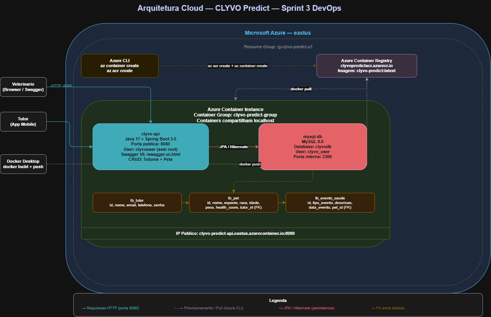

# 🐾 CLYVO Predict API — Sprint 3 DevOps

> **Java 17 · Spring Boot 3.5 · MySQL 8 · Docker · ACR + ACI · Azure**  
> FIAP Challenge 2026 — 2TDSPX Fevereiro  
> Disciplina: DevOps Tools & Cloud Computing

---

## 📖 Descrição da Solução

O **CLYVO Predict** é uma plataforma SaaS veterinária que centraliza a gestão de pets, prontuários, vacinas e agendamentos, com um algoritmo de **Health Score** (0–100) que detecta riscos de saúde de forma preditiva.

**Stack:** Java 17 + Spring Boot 3.5 + MySQL 8 + Docker  
**Deploy:** Azure Container Registry (ACR) + Azure Container Instance (ACI)  
**Persistência:** Azure Files (volume montado no container MySQL)  
**Opção escolhida:** ACR + ACI (containerização completa de App e Banco)

---

## 💼 Benefícios para o Negócio

| # | Benefício | Impacto |
|---|-----------|---------|
| 1 | Health Score preditivo | Detecta riscos antes de doenças se manifestarem |
| 2 | Alertas automáticos | Lembretes de vacinas reduzem faltas em 40% |
| 3 | Gestão centralizada | Elimina fichas físicas e planilhas |
| 4 | App do tutor | Fideliza donos com transparência do histórico |
| 5 | Deploy containerizado | Escalabilidade com custo reduzido via ACI |
| 6 | Volume persistente | Dados do banco preservados mesmo se container reiniciar |
| 7 | Conformidade LGPD | Dados sensíveis protegidos |

---

## 🏗️ Arquitetura da Solução




**Componentes:**
- **ACR** — Armazena a imagem Docker da API
- **ACI** — Executa os containers (API + MySQL) no mesmo grupo, compartilhando localhost
- **Azure Files** — Volume persistente montado em `/var/lib/mysql` no container do banco

---

## 👥 Equipe

| Nome Completo | RM |
|---------------|----|
| Eduarda Weiss Ventura | RM564434 |
| Maria Gabriela Landim Severo | RM565146 |
| Samara Porto Souza | RM559072 |
| Lucas Nunes Soares | RM566503 |
| Camily Vitoria Pereira Maciel | RM566520 |

**Turma:** 2TDSPX — Fevereiro 2026

---

## 🚀 Deploy completo na nuvem — Passo a passo

### Pré-requisitos

| Ferramenta | Instalação |
|------------|-----------|
| Azure CLI | [learn.microsoft.com/cli/azure](https://learn.microsoft.com/cli/azure/install-azure-cli) |
| Docker Desktop | [docker.com](https://www.docker.com/products/docker-desktop/) |
| Git | [git-scm.com](https://git-scm.com/) |

---

### Passo 1 — Clonar o repositório

```bash
git clone https://github.com/eduardawv/Clyvo-Predict-DevOps.git
cd Clyvo-Predict-DevOps
```

### Passo 2 — Login no Azure

```bash
az login
```

### Passo 3 — Executar o script de deploy

```bash
./azure-setup-sprint3.sh
```

O script cria automaticamente:
1. Resource Group `rg-clyvo-predict-s3`
2. Azure Container Registry `clyvopredictacr`
3. Build e push da imagem Docker para o ACR
4. Storage Account + Azure Files (volume persistente para o MySQL)
5. Container Group no ACI com dois containers (MySQL + API)

### Passo 4 — Verificar status dos containers

```bash
az container show \
  --resource-group rg-clyvo-predict-s3 \
  --name clyvo-predict-group \
  --query "containers[].{Nome:name, Estado:instanceView.currentState.state}" \
  --output table
```

Resultado esperado:
```
Nome       Estado
---------  --------
mysql-db   Running
clyvo-api  Running
```

### Passo 5 — Obter URL público

```bash
az container show \
  --resource-group rg-clyvo-predict-s3 \
  --name clyvo-predict-group \
  --query "ipAddress.fqdn" --output tsv
```

Resultado:
```
clyvo-predict-api.eastus.azurecontainer.io
```

### Passo 6 — Verificar Swagger UI

Abra no navegador:
```
http://clyvo-predict-api.eastus.azurecontainer.io:8080/swagger-ui.html
```

---

## 🧪 Testes do CRUD via terminal

> Substitua `<URL>` pelo FQDN obtido no Passo 5.  
> Exemplo: `<URL>` = `clyvo-predict-api.eastus.azurecontainer.io`

### 7.1 — CREATE: Inserir tutor

```bash
curl -X POST http://<URL>:8080/api/tutores \
  -H "Content-Type: application/json" \
  -d '{"nome":"Carlos Silva","email":"carlos@email.com","telefone":"11999990001","senha":"123456"}'
```

### 7.2 — Verificar INSERT no banco

```bash
az container exec \
  --resource-group rg-clyvo-predict-s3 \
  --name clyvo-predict-group \
  --container-name mysql-db \
  --exec-command "mysql -u clyvo_user -pClyvo@Pass123 clyvodb"
```

```sql
SELECT * FROM tb_tutor;
```

### 7.3 — CREATE: Inserir pet

```bash
curl -X POST http://<URL>:8080/api/pets \
  -H "Content-Type: application/json" \
  -d '{"nome":"Thor","especie":"Cachorro","raca":"Golden Retriever","idade":5,"peso":32.5,"tutorId":1}'
```

### 7.4 — Verificar INSERT do pet no banco

```sql
SELECT * FROM tb_pet;
```

### 7.5 — READ: Listar via GET

Via curl:
```bash
curl http://<URL>:8080/api/tutores
curl http://<URL>:8080/api/pets
```

Ou via Swagger UI: `GET /api/tutores` → Try it out → Execute

### 7.6 — UPDATE: Atualizar pet

```bash
curl -X PUT http://<URL>:8080/api/pets/1 \
  -H "Content-Type: application/json" \
  -d '{"nome":"Thor Atualizado","especie":"Cachorro","raca":"Golden Retriever","idade":6,"peso":33.0,"tutorId":1}'
```

### 7.7 — Verificar UPDATE no banco

```sql
SELECT * FROM tb_pet WHERE id = 1;
```

### 7.8 — DELETE: Remover pet

```bash
curl -X DELETE http://<URL>:8080/api/pets/1
```

### 7.9 — Verificar DELETE no banco

```sql
SELECT * FROM tb_pet WHERE id = 1;
-- Resultado esperado: Empty set (0 rows)
```

### 7.10 — Sair do MySQL

```sql
exit
```

---

## 🐳 Comandos manuais de build e push

> Observação: estes comandos já são executados automaticamente pelo
> `azure-setup-sprint3.sh`. Esta seção serve apenas como referência
> para execução manual e troubleshooting.

```bash
# Build da imagem
docker build -t clyvopredictacr.azurecr.io/clyvo-predict:latest .

# Login no ACR
az acr login --name clyvopredictacr

# Push para o ACR
docker push clyvopredictacr.azurecr.io/clyvo-predict:latest

# Verificar imagens no ACR
az acr repository list --name clyvopredictacr --output table
```

---

## 📋 Logs dos containers

```bash
# Logs da API
az container logs \
  --resource-group rg-clyvo-predict-s3 \
  --name clyvo-predict-group \
  --container-name clyvo-api

# Logs do MySQL
az container logs \
  --resource-group rg-clyvo-predict-s3 \
  --name clyvo-predict-group \
  --container-name mysql-db
```

---

## 🗑️ Deletar recursos

```bash
az group delete --name rg-clyvo-predict-s3 --yes --no-wait
```

Confirme em: [portal.azure.com](https://portal.azure.com) → Resource Groups

---

## 📂 Estrutura do repositório

```
Clyvo-Predict-DevOps/
├── Dockerfile                    # Multi-stage (JDK→JRE, user: appuser)
├── aci-deploy.yaml               # YAML ACI com volume Azure Files
├── azure-setup-sprint3.sh        # Script Azure CLI completo
├── docker-compose.yml            # Teste local
├── script_bd.sql                 # DDL das tabelas core
├── pom.xml
├── src/
│   └── main/resources/
│       ├── application.properties
│       └── application-prod.properties
└── README.md
```

---

## 🗄️ Banco de Dados

**Banco:** MySQL 8 (containerizado no ACI)  
**Persistência:** Azure Files montado em `/var/lib/mysql`  
**DDL:** [`script_bd.sql`](./script_bd.sql)  
**Tabelas core:** `tb_tutor` e `tb_pet` (FK: `tb_pet.tutor_id → tb_tutor.id`)

---

## ☁️ Recursos Azure

| Recurso | Nome |
|---------|------|
| Resource Group | `rg-clyvo-predict-s3` |
| Container Registry (ACR) | `clyvopredictacr` |
| Container Group (ACI) | `clyvo-predict-group` |
| Container App | `clyvo-api` |
| Container DB | `mysql-db` |
| Storage Account | `clyvostorage*` |
| File Share (volume) | `clyvo-mysql-data` |
| DNS público | `clyvo-predict-api.eastus.azurecontainer.io` |
